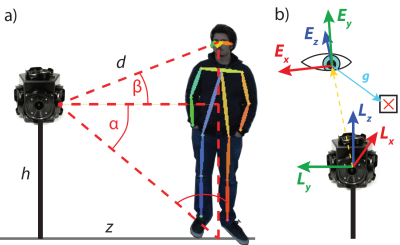

# Gaze360: Physically Unconstrained Gaze Estimation in the Wild Dataset

## About

This is a dataset of 197588 frames from 238 subjects with 3D gaze annotations as captured in our Gaze360 dataset. The dataset is for non-commercial research use only. By using this dataset you agree to terms of the [LICENSE](https://github.com/Erkil1452/gaze360/blob/master/LICENSE.md). If you use our dataset or code cite our [paper](http://gaze360.csail.mit.edu/iccv2019_gaze360.pdf) as:

 > Petr Kellnhofer*, Adrià Recasens*, Simon Stent, Wojciech Matusik, and Antonio Torralba. “Gaze360: Physically Unconstrained Gaze Estimation in the Wild”. IEEE International Conference on Computer Vision (ICCV), 2019.

```
@inproceedings{gaze360_2019,
    author = {Petr Kellnhofer and Adria Recasens and Simon Stent and Wojciech Matusik and and Antonio Torralba},
    title = {Gaze360: Physically Unconstrained Gaze Estimation in the Wild},
    booktitle = {IEEE International Conference on Computer Vision (ICCV)},
    month = {October},
    year = {2019}
}
```

You can obtain this dataset and more information at [http://gaze360.csail.mit.edu](http://gaze360.csail.mit.edu) .

## Content

The dataset contains body and head crops in original resolution as captured by our capturing setup based on Ladybug5 360 degree camera. The camera is equipped with 5+1 vertical sensors with `2048 x 2448` pixel resolution each. After rectification the images were stored as `3382 x 4096` pixel JPEG files. The provided crops are made from these original frames. As the camera sensor field of views overlap, same person may be captured by two cameras. Each such capture is treated as an independent sample (but all are counted as a single person in our 238 subject dataset).

[AlphaPose](https://github.com/MVIG-SJTU/AlphaPose) algorithm was used for detection of subjects in our images. Refer to our [paper](http://gaze360.csail.mit.edu/iccv2019_gaze360.pdf) for more details.

Additionally, we provide detections of eyes and faces from [dlib](http://dlib.net/) library wherever such detection is possible. Frames where such detection failed (occlusion, rear view,..) are marked by `-1` in respective fields.

## Structure

The dataset consists of
- This readme.
- Our [license](https://github.com/Erkil1452/gaze360/blob/master/LICENSE.md)
- `metadata.mat` Matlab file with annotations
- JPEG images with head and body crops (only head crops used in our paper)

## Metadata

The `metadata.mat` is a Matlab file which can be loaded using Matlab or using [scipy](https://www.scipy.org/) library for Python. Note that it uses **0-based indexing** (C-style) and not the 1-based indexing of Matlab. Therefore, if used in Matlab, +1 has to be added to every array access, e.g. `recName = recordings(recording(i) + 1);`. No such treatment is needed in Python which we use for our Pytorch model.

All entries have as many items as there are frames in the dataset. The only exception is `recordings` which only defines list of independent recording session names and `splits` which defines our split names. Each recording corresponds to an acquisition session with a group of unique subjects. Refer to our [paper](http://gaze360.csail.mit.edu/iccv2019_gaze360.pdf) for more details about the data collection procedure.

### 3D Coordinates
Two 3D coordinate systems are used. Refer to our [supplementary file](https://github.com/erkil1452/gaze360/blob/master/OpenGaze__ICCV_2019_Sup_.pdf) (most notably Figure 2) for more details. Briefly:
- **Ladybug camera coordinate system** - right-handed coordinate system with z-axis pointing up and origin in the center of the Ladybug camera system. Units are meters. Used for object positions.
- **Eye coordinate system** - right-handed coordinate system with y-axis pointing up and origin in the center of the Ladybug camera system. Units are meters. Origin and units are irelevant in practice as it is only used to express normalized gaze direction. The practical interpretation is that the positive x-axis points to the left, positive y-axis points up and positive z-axis points away from the camera, i.e. `[-1,0,0]` is a gaze looking to the right or `[0,0,-1]` straight into the camera from the camera's point of view, irrespective of subjects position in the world.


**3D Coordinate Systems**: (a) Estimting the subject's eye distance from camera using a ground plane assumption, and (b) the gaze transform between the subject's **Eye coordinate system** (`E`) and the **Ladybug camera coordinate system** (`L`). Positive `E_z` is pointing away.

Please note that although the 3D gaze (`gaze_dir`) is defined as a difference between target's and subject's positions (`target_pos3d - person_eyes3d`) each of them is expressed in different coordinate system, i.e. `gaze_dir = M * (target_pos3d - person_eyes3d)` where `M` depends on a normal direction between eyes and the camera. Refer to our [supplementary file](https://github.com/erkil1452/gaze360/blob/master/OpenGaze__ICCV_2019_Sup_.pdf) for details.

### 2D Coordinates
All 2D coordinates relate to a position inside the original rectified full frame with resolution of `3382 x 4096` pixels. Positions are stored as `[x, y]`. Bounding boxes are represented `[x,y,widht,height]`. All units are normalized, i.e. divided by the original frame resolution. Hence, `[0.0, 0.1, 0.1, 0.2]` is a `338 x 819` px box with offset of `[0, 410]` pixels.

We do not provide full frames as they may contain personal information of unparticipating parties. We only provided crops for heads and full bodies which are defined by bounding boxes found in fields `person_head_bbox` and `person_body_bbox`.

When working with these image crops, one must reproject the 2D coordinates in the `metadata.mat` from full frame into the actual crop.

**Example (in Python):**

`person_eye_left_bbox` defines bounding box for the left eye (if detected by dlib) inside the original full frame. To find its position inside the head crop we need to do:
```
headBBInFull = person_head_bbox[i,:]
eyeBBInFull = person_eye_left_bbox[i,:]
eyeBBInCrop = [
    (eyeBBInFull[0] - headBBInFull[0]) / headBBInFull[2], # subtract offset of the crop
    (eyeBBInFull[1] - headBBInFull[1]) / headBBInFull[3], 
    eyeBBInFull[2] / headBBInFull[2], # scale to smaller space of the crop
    eyeBBInFull[3] / headBBInFull[3], 
    ]
```
The resulting `eyeBBInCrop` is still in normalized coordinates. To convert to pixels one must do:
```
imHead = cv2.imread(/*<path to the head crop image>*/)
cropSizePx = [imHead.shape[1], imHead.shape[0]] # should be equal to -> (headBBInFull[2:] * [3382, 4096]).astype(int)
eyeBBInCropPx = np.concatenate([eyeBBInCrop[:2] * cropSizePx, eyeBBInCrop[2:] * cropSizePx]).astype(int)
```
This should allow to crop the image as:
```
imEye = imHead[
    eyeBBInCropPx[1]:(eyeBBInCropPx[1]+eyeBBInCropPx[3]), 
    eyeBBInCropPx[0]:(eyeBBInCropPx[0]+eyeBBInCropPx[2]),
    :]
```

### Splits ###

We have used standard `train`/`val`/`test` splits of the Gaze360 dataset for training and evaluation of our model. The list of splits can be found in the `splits` entry and the assignment of particular frame in the `split`. 

Our model is temporal and uses symmetrical radius of 3 frames around the *central frame* (i.e., 7 frames in total) to produce prediction of gaze for the central frame. The split is always defined for the *central frame*. The first 3 and last 3 frames of each sequence cannot be used (due to missing boundary frames) and are marked as split `unused` = `3`. Note, that these frames are still being fed to the network but we do not evaluate their gaze (they are not ever the *central frame*).

We also detect frames where `person_head_bbox` is (at least partially) occluded by the the target marker and mark them as `unused`. These frames can still be used as the 3-radius input but they are not used as the *central frame* for any phase of training / evaluation.

### Fields
- `recordings` - recording name lists, a string used to refer to the file structure.
- `recording` - an index (**0-based**) into `recordings`.
- `frame` - 0-based frame index since the start of the recording.
- `ts` - relative time (in seconds) since the start of the recording.
- `target_cam` - index of the camera (0-4) by which the target was captured.
- `target_pos3d` - 3D position of the target which subjects look at in **Ladybug camera coordinate system**.
- `target_pos2d` - 2D position of the target inside the original full frame image (normalized-coordinates)
- `person_identity` - a person identifier of a person used in the file structure. Unique only inside single recording. Note that a physical subject can have multiple identities inside the same recording due interuptions in tracking or capture in multiple cameras.
- `person_cam` - index of the camera (0-4) by which the subject was captured.
- `person_eyes3d` -  3D position of the subject's mid-eye point in **Ladybug camera coordinate system**.
- `person_eyes2d` - 2D position of the subject's mid-eye point inside the original full frame image (normalized-coordinates).
- `person_body_bbox` - bounding box of the subject's body in the original full frame image (normalized-coordinates).
- `person_head_bbox` - bounding box of the subject's head in the original full frame image (normalized-coordinates).
- `person_face_bbox` - bounding box of the subject's face in the original full frame image (normalized-coordinates) if detected by dlib, otherwise `[-1,-1,-1,-1]`.
- `person_eye_left_bbox` - bounding box of the subject's left eye in the original full frame image (normalized-coordinates) if detected by dlib, otherwise `[-1,-1,-1,-1]`.
- `person_eye_right_bbox` - bounding box of the subject's right eye in the original full frame image (normalized-coordinates) if detected by dlib, otherwise `[-1,-1,-1,-1]`.
- `gaze_dir` - 3D gaze direction in the **Eye coordinate system**
- `splits` - list of split names - `0 = train, 1 = val, 2 = test, 3 = 'unused`
- `split` - ID of the split where this frame was used, i.e. `0` for `train`, `1` for `val`, `2` for `test` and `3` for `unused`.

### Images

A corresponding image `i` can be accessed from this dataset base folder using the information in the `metadata.mat`.

In Python:
```
im = cv2.imread(os.path.join(
    'imgs',
    recordings[recording[i]],
    cropType,
    '%06d' % person_identity[i],
    '%06d.jpg' % frame[i]
    ))
```

In Matlab:
```
im = imread(fullfile(...
    'imgs',...
    recordings{recording(i) + 1},...
    cropType,...
    sprintf('%06d', person_identity(i)),
    sprintf('%06d.jpg', frame(i))...
));
```

`cropType` is either `body` or `head`. Note that we only use `head` in our models.

